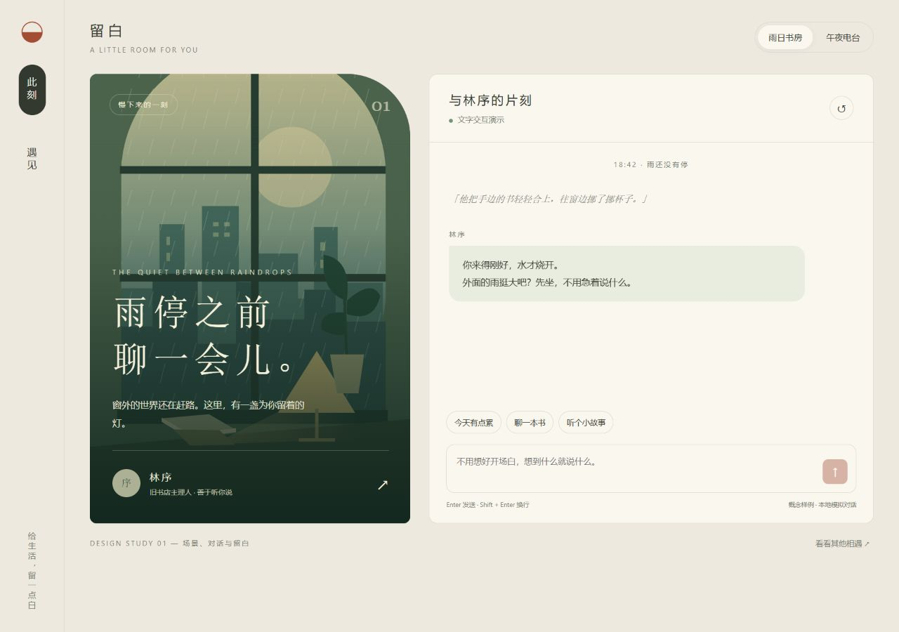
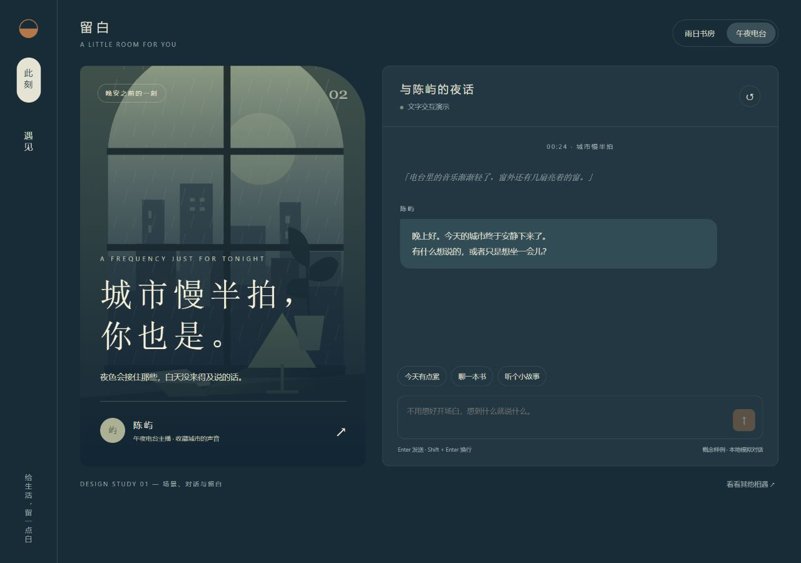
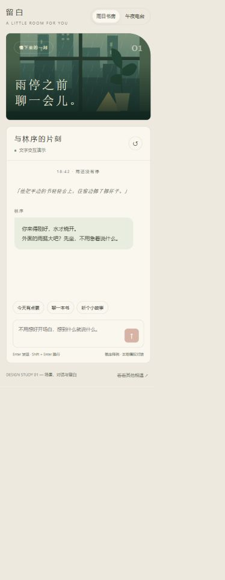

# Quiet Room — responsive interaction demo

An original HTML/CSS/JavaScript portfolio sample with two visual themes: a rainy reading room and a midnight radio studio. The interface copy is in Chinese. This is a synthetic concept project, not a previous client deployment.

## Run

Download this repository and open `index.html` in a browser. No installation, build step, external fonts or API keys are needed.

## What to try

- Switch the two theme buttons at the top of the page.
- Open the character discovery view and return to a conversation.
- Choose a suggested opening message or type your own.
- Press Enter to send or Shift+Enter for a new line.
- Reset the conversation and resize to a narrow viewport.

The page includes responsive layouts, inline SVG scene artwork, keyboard focus styles and a reduced-motion preference. The reply flow uses predefined local text. It has no model backend, account system, payments, persistent chat storage or network requests.

## Previews

### Desktop: reading room

### Desktop: midnight radio

### Narrow screen

## Scope and verification

The published HTML is the same demo previously checked locally for theme switching, discovery navigation, message entry, resetting and narrow-screen layout. The screenshots show that local demo. This repository is a source-code sample; it does not demonstrate React, Webflow or WordPress integration, cross-browser certification, a production backend or client acceptance.
